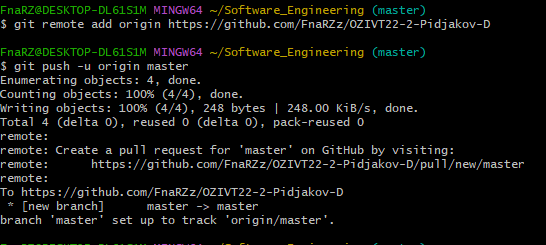
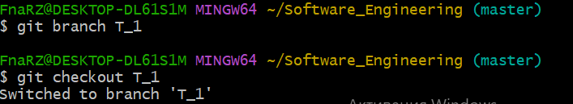
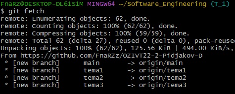
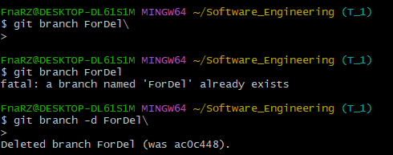
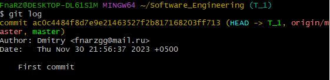
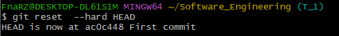
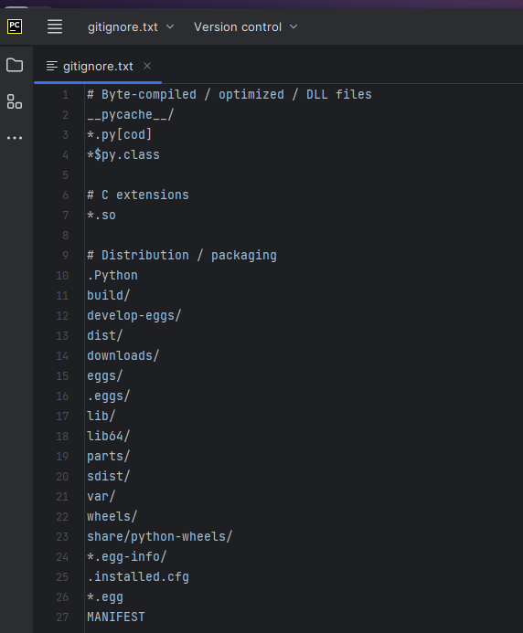

# Тема 1. Работа с Git
Отчет по Теме #1 выполнил(а):
- Пиджаков Дмитрий Сергеевич
- ОЗИВТ22-1у
Работу проверили:
к.э.н., доцент Панов М.А.

## 2.1 Установка

## 2.2 Настройка

## 2.2 Настройка

## 2.3 Создание нового репозитория

## 2.4 Подготовка файла

## 2.5 Подключение к удаленному репозиторию

## 2.7. Ветвление

## 2.8. Особенности применения «Фетч»

## 2.9. Удаление файлов, веток, локальных и удалённых репозиториев

## 2.10. Отслеживание изменений в коммитах

## 2.11. Возвращение файла к предыдущему (определенному) состоянию

## 2.12. Возвращение к предыдущему коммиту

## 2.13. Исправление коммита

## 2.14. Разрешение конфликтов при слиянии

## 2.15. Настройка .gitignore

Общий вывод: Изучил команды и функции в Распределённой системе управления версиями - Git в интерфейсе Bash. Но думаю что Git Gui передается визуально намного лучше, после изучения Git Bash.
