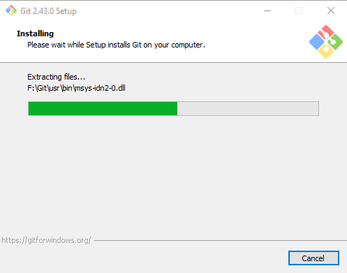
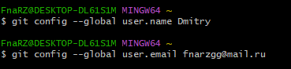
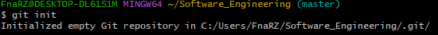
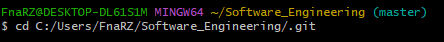
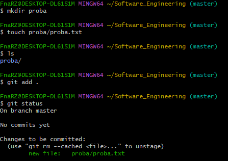

# Тема 1. Работа с Git
Отчет по Теме #1 выполнил(а):
- Пиджаков Дмитрий Сергеевич
- ОЗИВТ22-1у
Работу проверили:
к.э.н., доцент Панов М.А.

## 2.1 Установка

## 2.2 Настройка

## 2.2 Настройка

## 2.3 Создание нового репозитория

## 2.4 Подготовка файла

